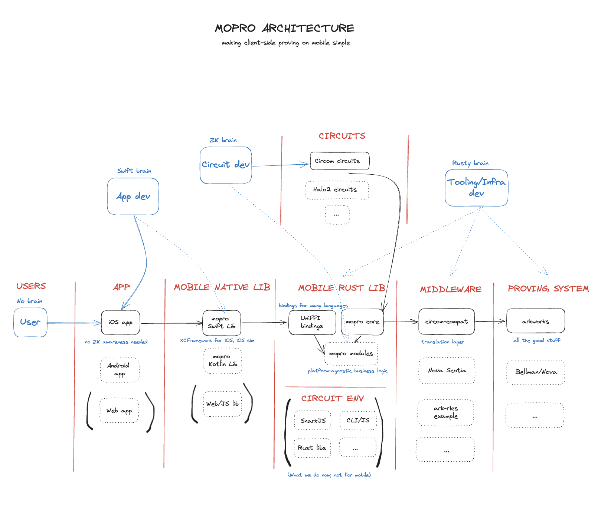

# mopro

Making client-side proving on mobile simple (and fast).

## Overview

- `mopro-cli` - core Rust CLI util (NOTE: Very early; use `mopro-core` for now).
- `mopro-core` - core mobile Rust library.
- `mopro-ffi` - wraps `mopro-core` and exposes UniFFI bindings.
- `mopro-ios` - iOS CocoaPod library exposing native Swift bindings.
- `mopro-android` - Android library exposing native Kotlin bindings.
- `mopro-example-app` - example iOS app using `mopro-ios`.
- `ark-zkey` - helper utility to make zkey more usable and faster in arkworks.

## Architecture

The following illustration shows how mopro and its components fit together into the wider ZKP ecosystem:


Zooming in a bit:



## How to use

### Prepare circuits

-   Install [circom](https://docs.circom.io/) and [snarkjs](https://github.com/iden3/snarkjs)
-   Run `./scripts/prepare.sh` to check all prerequisites are set.

(Note that we require `uniffi-bindgen` to be `0.25`, if you have an older version you might need to remove this to re-install the latest).

### iOS

#### Prepare

-   Install [cocoapods](https://cocoapods.org/)

#### Build Bindings

To build bindings for iOS simulator debug mode, run

```sh
./scripts/build_ios.sh simulator debug
```

Open the `mopro-ios/MoproKit/Example/MoproKit.xcworkspace` in Xcode.

#### Update Bindings

To update bindings, run `./scripts/update_bindings.sh simulator|device debug|release`.

-   `simulator` is for building library to run on iOS simulator, `device` is for running on a real device
-   `debug` is for Rust library to be in debug mode and `release` for release mode

### Android

#### Prepare

-   Install [Android Studio](https://developer.android.com/studio)
-   Open Android Studio, and navigate to SDK Manager > SDK Tools > NDK (Side by Side) as laid out on the [Android Developer site](https://developer.android.com/studio/projects/install-ndk#default-version).
-   Export `$ANDROID_HOME` and change `{USER_NAME}` to your username
    ```sh
    export ANDROID_HOME="/Users/{USER_NAME}/Library/Android/sdk"
    ```
-   Locate which NDK version you have by
    ```sh
    ls $ANDROID_HOME/ndk
    # 26.1.10909125
    ```
    and set it to your `NDK_PATH` environment variable. e.g.
    ```sh
    NDK_PATH=$ANDROID_HOME/ndk/26.1.10909125
    ```
    > Reference: [Running Rust on Android with UniFFI](https://sal.dev/android/intro-rust-android-uniffi/)

#### Build and Update Bindings

To build bindings for android simulator debug mode, run

```sh
./scripts/build_android.sh arm64 debug
```

- **Device types:** `x86_64`, `x86`, `arm`, `arm64`
  Check your device architecture here: https://doc.e.foundation/devices
  For Android Studio simulator (Pixel series), choose `arm64`
- **Mode:** `debug`, `release`

## Community and Talks

Join the Telegram group [here](https://t.me/zkmopro).

Talk by @oskarth at ProgCrypto/Devconnect (Istanbul, November 2023): [Slides](https://docs.google.com/presentation/d/1afIEgm8oYRvteWxUd04CcMOxChAiHaD55d5AKd0RkvY/edit#slide=id.g284ac8f47d5_2_24) (video pending)

## Performance

Preliminary benchmarks on an iPhone 14 Max Pro:

- Keccak256 (150k constraints): 1.5s
    - ~x10-20 faster vs comparable circuit in browser
- anon-aadhaar / RSA Verify: ~6.5s
    - ~5s for witness generation (still in WASM), ~2s prover time
    - 80% of time on witness generation
    - ~x10 faster vs browser on phone
- Bottlenecks: loading zkey and wasm witness generation

## Acknowledgements

This work is sponsored by a joint grant from [PSE](https://pse.dev/) and [0xPARC](https://0xparc.org/).
